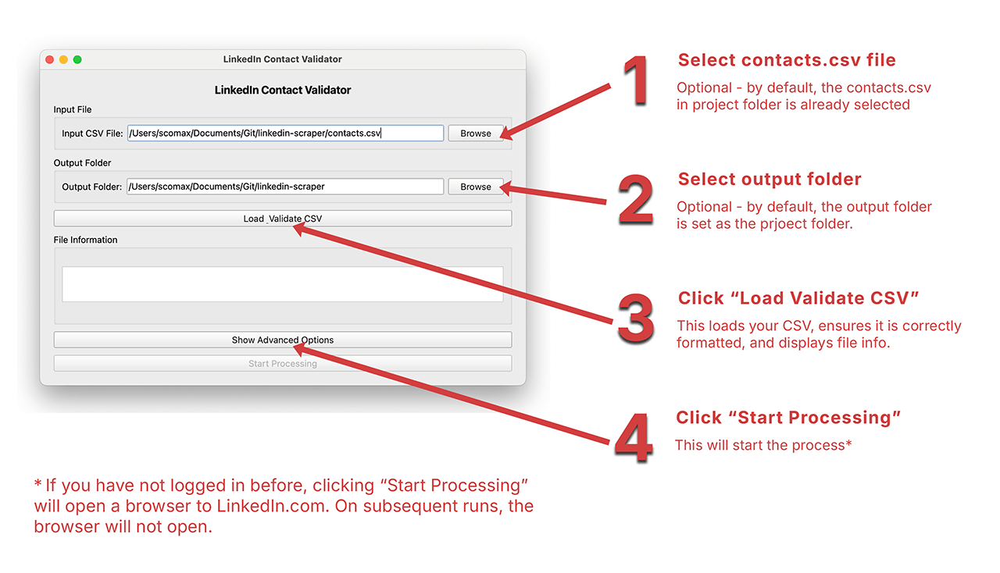

# LinkedIn Employment Checker

This tool checks if people from your contacts list are currently employed at specific companies by looking at their LinkedIn profiles.

## Setup

### 1. Install Python requirements
Open Terminal (Mac) or Command Prompt (Windows) in the project directory and run:
```bash
pip install -r requirements.txt
```

### 2. Add Brave Search API Key
- Copy the `.env-example` file and rename to `.env`
- Paste your API key in there

### 3. Prepare your contacts.csv file
Place your `contacts.csv` file in the root directory with these exact column names:
- `First Name`
- `Last Name`
- `Account Name` (this is the company name)

This program will read this CSV and save it with updates. Two new columns will be added: "Valid" and "Note".
*Warning*: Warning: This program will modify the CSV by adding two new columns and saving changes to the same file. To preserve the original, make a copy and store it elsewhere before running.

# Run the application
**Windows users:** Double-click `run_app_windows.bat`

**Mac users:** Double-click `run_app_mac.command`



## Demo Video
[Demo video on YouTube](https://www.youtube.com/watch?v=PTB3Wc7H4_c)
[](https://www.youtube.com/watch?v=PTB3Wc7H4_c)

### Logging In
If you have not logged in before (or not for a while anyway) then the first time you launch the program, it will go to the LinkedIn login page.
*Steps*:
- Log in when presented the LinkedIn login page.
- Wait for the browser to load and take you to your LinkedIn homepage.
- Pull up the Terminal/Command Prompt that is running the program and hit `Enter`
The purpose of this is because the amount of time to log in is so variable, it is better for you to confirm once you are logged in rather than the program guessing.

Once you have hit Enter, the program will begin processing. The next time you open and run the program, it will not show the browser since it will use the browser cookies from your original logged-in session.

If you have problems with LinkedIn and it has been a few days or weeks since you last logged in, you should:
- Delete the "linkedin_cookies.json" file saved in this project folder,
- Reopen the program

### Important Notes
⚠️ **Risk Warning:** The application may crash due to:
- Rate limiting by LinkedIn
- Blocking by search engines (Google/Bing)
- Network connectivity issues
- Browser automation detection

If the app crashes, you can restart it and it will continue from where it left off.

## What it does
- Reads your contacts from the CSV file
- Checks each person's LinkedIn profile to see if they work at the listed company
- Updates the CSV with True/False results
- Processes contacts in small batches to minimize blocking

Results:
- `Valid`: Column indicating True/False if the contact is still at the company
- `Note` Column indicating any issue with processing the contact (e.g. "Profile not found")